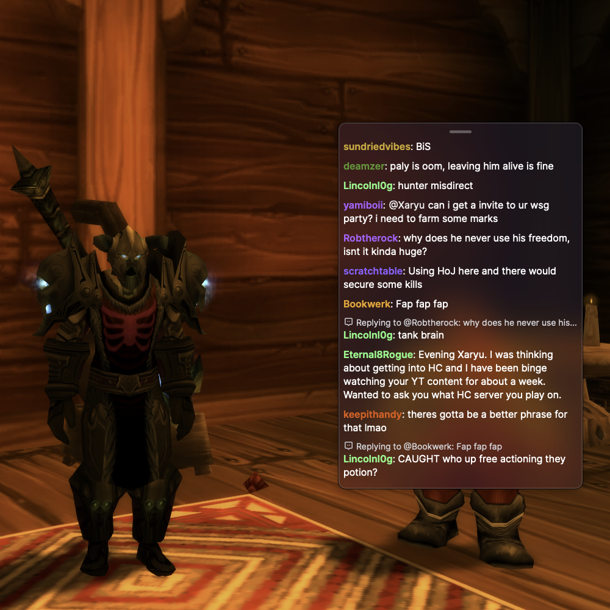

# Twitch Chat Overlay for macOS


If you stream on Twitch with a single monitor, you've probably dealt with this: you're in the middle of a game, chat is active, and you have no idea what anyone is saying. Alt-tabbing kills the vibe and makes you look distracted on stream.

This app puts your Twitch chat directly on screen as a transparent overlay that floats on top of your game. Click-through mode means you can keep playing without the overlay getting in the way.

Built for macOS. Works with any game running in fullscreen windowed/borderless mode.



## Download

Grab the latest `.dmg` from the [Releases](../../releases) page.

### First launch

Since this app isn't signed with an Apple Developer certificate, macOS will block it the first time you try to open it. You'll see something like *"Overlay can't be opened because Apple cannot check it for malicious software."*

To fix this, right-click (or Control-click) the app and select **Open**, then click **Open** again in the dialog. You only need to do this once.

If that doesn't work, open Terminal and run:
```bash
xattr -cr /Applications/Overlay.app
```

## What it does

- Displays Twitch chat in a floating window that stays on top of games
- Separate alerts overlay for StreamElements, Streamlabs, or any browser source
- Transparent glassmorphic background (Apple-style blur effect)
- Click-through mode so you can interact with your game (toggle with Ctrl+§)
- Minimal chat style strips away the Twitch UI, leaving just usernames and messages
- Adjustable text size (small/medium/large) and opacity controls
- Keyword alerts highlight messages containing specific words
- Custom hotkey configuration
- Custom font selection for chat
- Remembers window positions between sessions
- Menu bar icon for quick access

## Setup

### Chat Overlay

1. Go to your Twitch channel, click the chat settings gear, select "Popout Chat"
2. Copy the URL (looks like `https://www.twitch.tv/popout/yourchannel/chat`)
3. Open Overlay settings, paste the URL, click Apply

### Alerts Overlay (Optional)

1. Get your alerts overlay URL from StreamElements, Streamlabs, or your preferred service
2. Open Overlay settings, scroll to "Alerts Overlay" section
3. Paste the URL, click Apply
4. Use the menu bar icon to show/hide the alerts window

Both windows share the same click-through toggle, so one hotkey controls both.

## Controls

| Action | How |
|--------|-----|
| Move window | Drag the bar at the top |
| Resize | Drag edges/corners |
| Toggle click-through | Ctrl+§ (customizable) |
| Show/hide alerts | Menu bar icon |
| Settings | Cmd+, or menu bar icon |

## Advanced Options

In Settings, expand "Advanced Options" to access:

- **Custom Hotkey** — Change the click-through toggle shortcut to any key combination
- **Chat Font** — Choose a different font for chat messages (requires Minimal Style)
- **Keyword Alerts** — Add words to highlight in chat (e.g., your username). Matching messages get a colored background

## Game compatibility

Works with games running in fullscreen windowed or borderless mode:

WoW, League, Valorant, FFXIV, CS2, Dota 2, Overwatch 2, Diablo IV, Path of Exile, and basically any modern game with a borderless option.

Doesn't work with true exclusive fullscreen (the game takes over the display completely and overlays can't show).

## Troubleshooting

**Overlay not showing in game** — Make sure your game is set to fullscreen windowed or borderless, not exclusive fullscreen.

**Hotkey not working** — Go to System Settings → Privacy & Security → Accessibility and enable Overlay. Restart the app.

**Chat not loading** — Double-check your URL is a valid Twitch popout chat link.

**Alerts not loading** — Make sure your alerts URL is correct. StreamElements/Streamlabs URLs should start with their domain.

**Window disappeared** — Use Settings → Reset Chat Window Position or Reset Alerts Window Position.

## Built with

Swift, SwiftUI, AppKit, WebKit

## Made by

I built this because I needed it for my own streams. If you want to see it in action or just hang out, come say hi at [twitch.tv/miikkislive](https://twitch.tv/miikkislive).

## License

All Rights Reserved © 2026

This software is proprietary. No permission is granted to use, copy, modify, or distribute this software or its source code without explicit written permission from the author.
